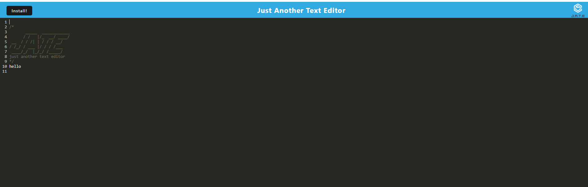

# Progressive Web Applications (PWA): Text Editor

## Table of Contents
- [Description](#description)
- [User Specifications](#user-specifications)
- [Functionality](#functionality)
- [Mock-Up](#mock-up)
- [Screenshots](#screenshots)
- [Deliverables](#deliverables)

## Description

The task is to build a text editor that runs in the browser. The app will be a single-page application that meets the PWA criteria. Additionally, it will feature a number of data persistence techniques that serve as redundancy in case one of the options is not supported by the browser. The application will also function offline.

To build this text editor, we will start with an existing application and implement methods for getting and storing data to an IndexedDB database.We will use a package called `idb`, which is a lightweight wrapper around the IndexedDB API. It features a number of methods that are useful for storing and retrieving data, and is used by companies like Google and Mozilla.

## User Specitifcations

AS A developer
I WANT to create notes or code snippets with or without an internet connection
SO THAT I can reliably retrieve them for later use

## Functionality

GIVEN a text editor web application.

When the user opensthe application in my editor, the user should see a client server folder structure.

When the user runs `npm run start` from the root directory, the user will find the application should start up the backend and serve the client.

When the user runs the text editor application from my terminal, the user finds that my JavaScript files have been bundled using webpack.

When the user runs my webpack plugins, the user finds a generated HTML file, service worker, and a manifest file.

When the user enters content and subsequently click off of the DOM window, the content in the text editor has been saved with IndexedDB.

## Mock-Up

The following animation demonstrates the application functionality:

The following image shows the application's `manifest.json` file:

The following image shows the application's registered service worker:

The following image shows the application's IndexedDB storage:

## Screenshots

## Deliverables

The URL of the deployed application https://aqueous-temple-16801.herokuapp.com/

The URL of the GitHub repository: https://github.com/dawn-kline-m/Progressive-Web-Application
